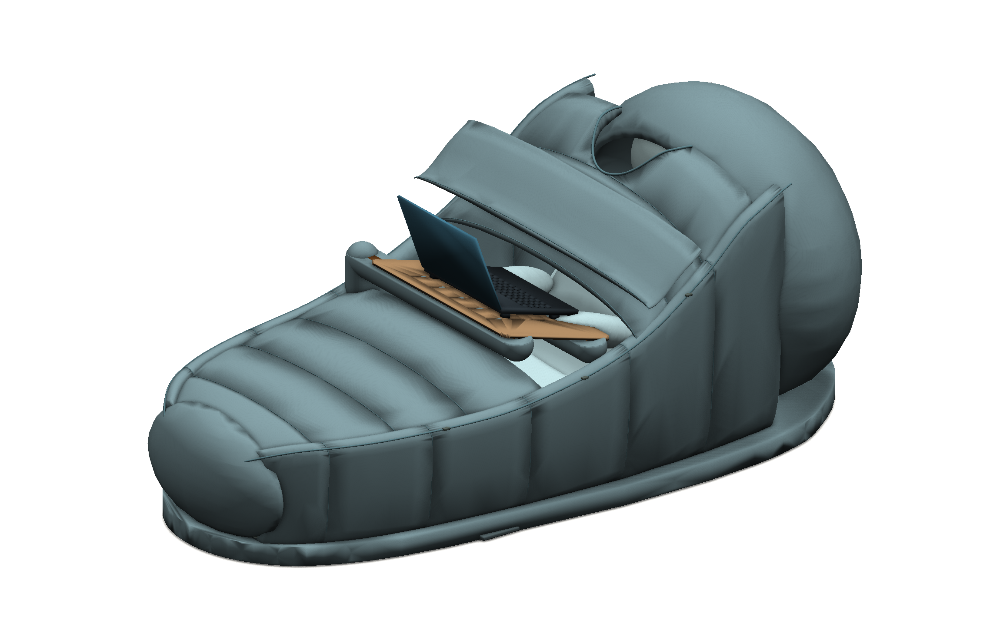

# CAD: модели и результаты «Лежандра»

**Рабочая ветка: `sync/r01-r06-20261002`. Последняя конструкция: R06.**

CAD хранится обычными файлами в каталоге `revisions/`, не ZIP-архивом и не временным Actions artifact. В `main` эти изменения пока не слиты.

## Открыть последнюю итерацию

| Материал | Файл или каталог |
|---|---|
| PDF-альбом R06, 14 страниц A3 с CAD-видами | [Lezhandr_R06_CAD_review.pdf](revisions/R06/docs/Lezhandr_R06_CAD_review.pdf) |
| Рабочий кокон, отогнутый клапан клавиатуры | [Lezhandr_R06_folded.step](revisions/R06/cad/Lezhandr_R06_folded.step) |
| Рабочий кокон, закрытый клапан | [Lezhandr_R06_work.step](revisions/R06/cad/Lezhandr_R06_work.step) |
| Внутреннее устройство с человеком | [Lezhandr_R06_occupied_interior.step](revisions/R06/cad/Lezhandr_R06_occupied_interior.step) |
| Внутреннее устройство без человека | [Lezhandr_R06_interior.step](revisions/R06/cad/Lezhandr_R06_interior.step) |
| Расслабленное положение | [Lezhandr_R06_relax.step](revisions/R06/cad/Lezhandr_R06_relax.step) |
| Самостоятельная опора столика | [Lezhandr_R06_table.step](revisions/R06/cad/Lezhandr_R06_table.step) |
| Слои утеплённого укрытия | [Lezhandr_R06_layers.step](revisions/R06/cad/Lezhandr_R06_layers.step) |
| Все девять сборок и геометрические данные R06 | [cad/](revisions/R06/cad/) |
| Исходники построения, рендера и проверки | [source/](revisions/R06/source/) |
| Рендеры модели | [renders/](revisions/R06/renders/) |
| Макетные развёртки наружных и внутренних слоёв | [patterns/](revisions/R06/patterns/) |
| Реальный снимок работающего VTK-просмотрщика | [VTK_R06_actual.png](revisions/R06/screenshots/VTK_R06_actual.png) |

### Внешний вид последней конструкции

Этот PNG совпадает побайтно с изображением `work_folded.png` из исходного архива R06: Git blob `c6b4d11e486698502e13d4dbdfc91fb793b2c1aa`. Текущая загрузка не меняла дизайн или уже опубликованные файлы R05/R06.

## Предыдущие CAD-ревизии

| Ревизия | STEP-сборки | Где смотреть |
|---|---:|---|
| R01: первоначальная жёсткая конструкция | 2 | [CAD, STL, DXF, исходники и рендеры](revisions/R01/cad/) |
| R02: напольный мягкий кокон | 2 | [CAD, STL, DXF, швейные поверхности и рендеры](revisions/R02/cad/) |
| R04: пассивный откидной кожух и исследование ткани | 3 | [CAD](revisions/R04/cad/), [исходники](revisions/R04/source/), [OBJ](revisions/R04/exchange/), [виды](revisions/R04/renders/) |
| R05: локальная С-образная конструкция | 7 | [CAD и геометрические данные](revisions/R05/cad/) |
| R06: мягкая спинка без спинной рамы, упор стоп, пухлое укрытие | 9 | [CAD и геометрические данные](revisions/R06/cad/) |

R03 относится к вышивке и не добавляет отдельную CAD-ревизию корпуса. Всего проверено **23 самостоятельные STEP-сборки**, без повторного подсчёта копий в `history/`.

## Что проверил GitHub Actions

[Успешный запуск публикации CAD](https://github.com/Eljah/legeandre/actions/runs/37036217417) создал [коммит cad2735720d2f33145d1de54de72d4f8a94a17f8](https://github.com/Eljah/legeandre/commit/cad2735720d2f33145d1de54de72d4f8a94a17f8).

- Добавлены 82 CAD-связанных файла: недостающие STEP, STL, OBJ, DXF, виды, исходники, сетки и результаты. Отдельным предшествующим коммитом восстановлен входной `R04/history/project_R02.json`.
- Все 23 STEP повторно импортированы в OpenCASCADE и признаны геометрически валидными.
- У семи восстановленных сборок R01/R02/R04 количество тел, количество граней и габариты совпали с оригинальными файлами. Максимальная разница проверенных габаритов — 0 мм. Это ограниченная геометрическая проверка, не доказательство побайтной тождественности экспорта.
- Аудит 13 CAD DXF прошёл без ошибок и исправлений.
- 120 уже находившихся в Git файлов R05/R06 сохранены без изменения контрольных сумм.
- ZIP в дерево проекта не добавлялся; push без force; `main` не менялся.

Машиночитаемый отчёт с размерами и SHA-256 каждого STEP: [CAD_PUBLISH_VERIFICATION.json](provenance/CAD_PUBLISH_VERIFICATION.json).

## Происхождение и ограничения

Недостающие экспорты R01/R02/R04 заново получены из исходных программ, проверенных по SHA-256. R05/R06 были восстановлены предыдущим успешным запуском из сохранённых исходников; в этой публикации не пересобирались. STEP и PDF, пересозданные программами, могут отличаться служебными данными от старых вложений. Источники и проверяемый последний дизайн не заменялись новыми эскизами.

Это файлы CadQuery/OpenCASCADE и STEP, а не собственные документы SolidWorks с деревом построения. STEP предназначен для импорта в CAD; исходное параметрическое построение находится в Python.

Геометрическая валидность не подтверждает несущую способность, давление на тело, динамику гранул или тепловую безопасность. Лекала остаются макетными. Нагрев рук удалён из поздней геометрии; старые платы/прошивки этим коммитом не менялись. Столик не является опорой для вставания.
