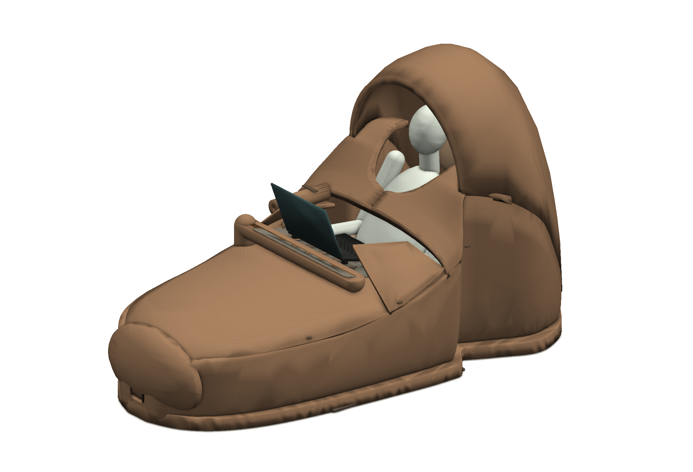

# Лежандр R08: исправления геометрии и новый текстильный облик

[PDF-отчёт, 16 листов A3](revisions/R08/docs/Lezhandr_R08_CAD_Cutting_Assembly.pdf) · [CAD](revisions/R08/cad) · [Рендеры](revisions/R08/renders) · [Раскрой P0](revisions/R08/patterns) · [Жгуты и молнии](revisions/R08/harness) · [Тепловые расчёты](revisions/R08/thermal)

Подтверждённые пересечения приёмников R07 с манекеном устранены. В R08 нет длинного металлического теплоотвода через тело. Капюшон и нижний чехол имеют общую пространственную кромку; наружные поверхности матовые, сепийные и без внешней поперечной пуховой стёжки.

Это цифровой инженерный прототип. Раскрой новых поверхностей имеет статус P0: измерения ткани и примерочный пошив не выполнены; внутренние мешки наполнителя не переаттестованы. Выход показан габаритно, без расчёта вставания. Электроника и прошивки предыдущих ревизий не переделаны; нагрев на человеке и во сне не разрешён.

[Сборка и выход](revisions/R08/docs/ASSEMBLY_EXIT_WIRING_RU.md) · [Проверки](revisions/R08/tests/verification.json) · [Происхождение и публикация](provenance/R08_PUBLICATION.json)

R01–R06 сохранены без изменений. R07 добавлена как сохранённый исходный код с заново выполненными CAD/тепловыми экспортами; это не новая конструктивная итерация R07. R08 — отдельная новая ревизия. Файлы в Git размещены по отдельности, не архивом.
